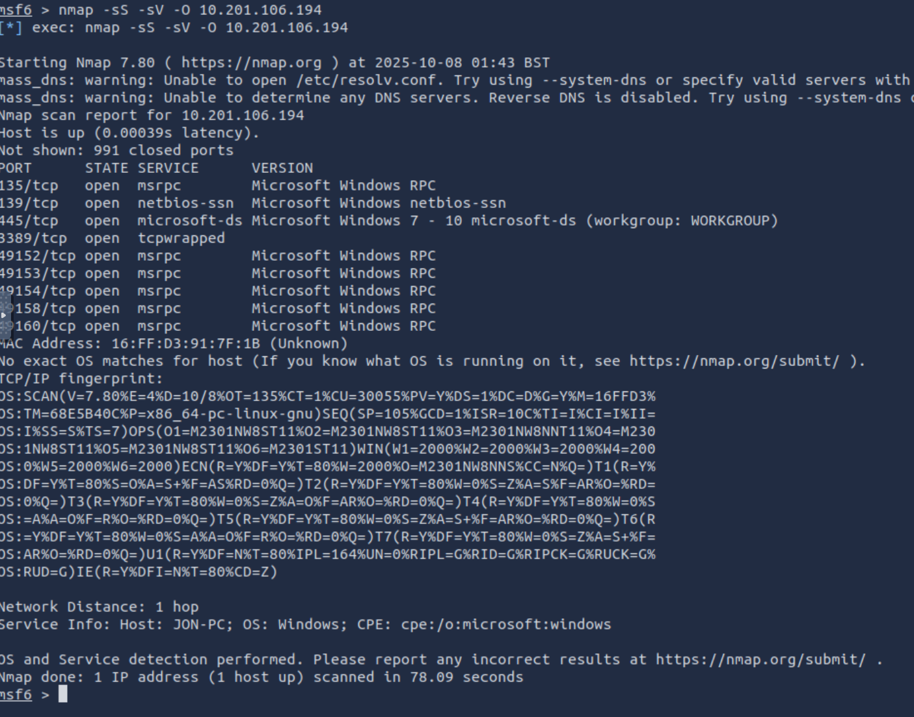

# Blue
# link https://tryhackme.com/room/blue

## Description

This room is about to hack a Windows Machine and leveraging some common misconfigurations issues.

Tools Used

- nmap : to enumerate the target host and know information about the host like open ports…
- metasploit : to exploit the vulnerability
- crackstation : to crack the hash

## Task 1 : Reconnaissance

For this task we will do a reconnaissance on our target using Nmap

Target IP : 10.201.116.233

As we can see, our nmap scan give us a lot of information :

We have an interestings port open that can be vulnerable, for exemple : 139/tcp, 135/tcp and 445/tcp

Based on the open port and the windows version, i use metaspoilt to check if the target was vulnerable to eternalblue vulnerability who exploit SMB protocol. So the scanner tell me that the target is vulnerable to the MS17-010 know as EternalBlue(**CVE-2017-0144**).

## Task 2 : Gain Access

To gain access and exploit this vulnerability, we will use Metasploit. First thing to do is to search the exploit for this MS17_010 vulnerability using the command search in metasploit.

We found the following exploit : **exploit/windows/smb/ms17_010_eternalblue**

This exploit required the RHOSTS, our rhosts here is the target machine. and need a payload, we will set **windows/x64/shell/reverse_tcp** as our payload.

As you can see in the picture above, all our options are set, now we can run the exploit.

As you can see in the picture above, we have access now to shell of our target.

Note that we have a shell, now we want to trun this shell into a meterpreter. To do that we will the post command know as **post/multi/manage/shell_to_meterpreter.** This post only required the id of the shell session that we want to turn into a meterpreter.

As you can see, we have now our meterpreter session.

So now we use the hashdump command to dump all the hash present on the sam database. as you can see in the pictures above. Next step is to crack the user jon hash.

We use the online tool [https://crackstation.net/](https://crackstation.net/) to crack this hash

Next step of our room is to find the flags

Flag1? *This flag can be found at the system root.*

We know that in windows, the system root directory is C:\. So i go to that directory and find the first flag. As you can see in picture below.

Flag2? *This flag can be found at the location where passwords are stored within Windows.*

- Errata: Windows really doesn't like the location of this flag and can occasionally delete it. It may be necessary in some cases to terminate/restart the machine and rerun the exploit to find this flag. This relatively rare, however, it can happen.

So to find that one, i use the search command in windows, dir /s flag2.txt that command search for the file flag2.txt in the C:\ directory and the /s is to tell the machine to search even in subfile. The steps is in pictures below.

flag3? *This flag can be found in an excellent location to loot. After all, Administrators usually have pretty interesting things saved.* 

So for the flag3, i just go in the user files and search in the directory i found there and the flag was in the documents directory.

